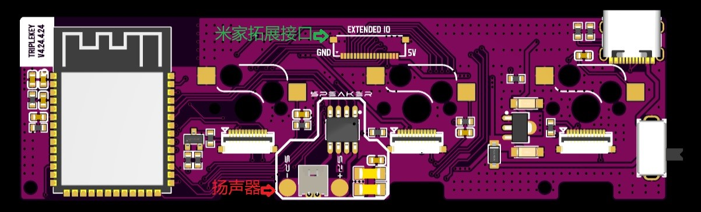
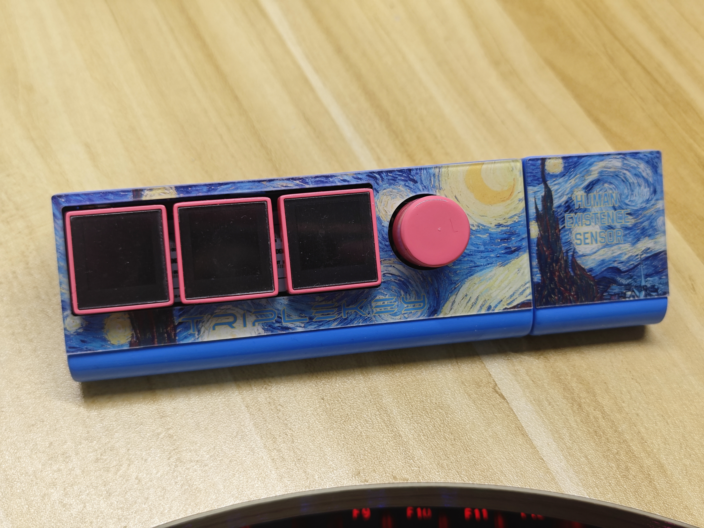

# TripleKey

## 项目说明

基于ESP32-S3的蓝牙小键盘，具有时间显示、天气预报、实时股票、宏键盘、蓝牙键盘、倒计时、人在感应、米家智能家居控制等功能。

立创开源地址：[嘉立创EDA开源硬件平台](https://oshwhub.com/chancenj/superkey)

Github地址：[Gituhb](https://github.com/ChancenJ/TripleKey)

Gitee地址：[Gitee](https://gitee.com/chancenj/triplekey)

## 开源协议

CC BY-NC-SA 4.0（署名-非商业性使用-相同方式共享 4.0 国际）

## 项目功能

- 时间显示、实时天气、天气预报、气象预警、实时股票等信息显示。
- 蓝牙键盘、宏键盘、快捷键、快捷网页、媒体控制等控制电脑功能。
- 倒计时等计时功能。
- 通过网页对多项功能自定义配置。
- 【可选，需N16R2】照片轮播功能。
- 【可选，需额外硬件】接入米家，作为米家无线开关和状态寄存器。
- 【可选，需额外硬件】人体存在感应，有人时自动亮屏，无人时自动熄屏，有无人状态接入米家，可搭配米家智能家居设备进行智能联动。

功能展示：[功能展示](https://b23.tv/3Hd1zba)

主体装配视频：[主体装配视频](https://b23.tv/uhOZp0Y)

## 项目属性

本项目衍生自MakerM0的开源项目[3Plus_v2](https://github.com/MakerM0/3Plus_v2)，优化了PCB布局，替换部分器件，引出拓展接口，增加米家拓展部分，接入米家平台，增加人体存在传感器；更换屏幕方案，大幅降低屏幕成本；重新设计外壳，增加米家拓展部分外壳；在其代码框架基础上增加实时天气、天气预报、气象灾害预警、实时股票信息、米家设备控制、照片轮播、倒计时、WebServer自定义配置、网页后台、人体存在检测、固件检测升级，增加中文UI，优化快捷键功能，优化部分代码结构，修复时钟和快捷网页BUG，修复开机闪屏，去除冗余代码。

## 硬件准备

### 硬件说明

#### 主控

ESP32-S3-WROOM-1-N8R2或ESP32-S3-WROOM-1-N16R2。区别在于后者拥有更多ROM，可实现更多功能。当前N16R2对应固件额外支持照片轮播，可自行上传照片在屏幕上显示。建议使用成本略高的N16R2，8MB版本受限于其空间，可能不再更新固件。

#### 旋转编码器

立创EDA中使用阿尔卑斯阿尔派EC11J1524413，成本高昂。若需要降低成本，可选择廉价普通插件编码器改贴片，详见后文额外BOM表。区别在于质感和焊接方式，编码器限位值和正反方向不同，可进行自定义配置。

#### 屏幕

- 方案一：0.85英寸长排焊接12PIN（驱动GC9107）直达链接：https://m.tb.cn/h.gXZoDytOg9CEca7?tk=Qb9vWtzlGgj

此方案一定需要定位板，焊接及组装方式详见后文。

- 方案二：0.85英寸长排插接12PIN（驱动NV3023）直达链接：https://m.tb.cn/h.gc6dU3OZHkynqdG?tk=nWm8WtzFscl

此方案定位板非必须，但为了按键稳固，依然推荐使用定位板但无需焊接，组装方式详见后文。

==区别在于两者成本，方案一成本约15元，但需要焊接屏幕和FPC排线座，方案二成本约30元，直接插接主板。两者固件不同，功能一致。==

### 硬件准备

#### PCB

PCB共分为主板、定位板、拓展板，工程中已标明。

主板必备，定位板强烈推荐（屏幕方案一必备），拓展板可选（用于接入米家和人在感应）。

**主板**

扬声器与米家拓展接口已标出，可选择性焊接。

**定位板**

用于固定键轴和方案一的屏幕连接。（方案一如下图所示焊接屏幕、安装键轴，屏幕方案二无需焊接）

**米家拓展板**

==根据3D打印外壳方案进行选择==

------

- 20240605修改

对米家拓展方案进行了改进，放入一个外壳，详见[TripleKey小键盘米家拓展方案改进版](https://oshwhub.com/chancenj/triplekey_v2_1)。

**如果你看到了此段内容，不管是否需要米家，都推荐直接使用改进版，不再查看下方原内容，只有米家拓展方案不同。**

**改进内容**

将主板与拓展板放入一个外壳，改用**HLK-LD2410B**（[直达链接](https://m.tb.cn/h.g484iFO)）作为人体存在传感器。

如果在原项目中使用了**拓展方案2**进行3D打印，可直接打板**【拓展方案3】米家及人在传感器拓展_贴**放入原外壳。

如果需要对外壳重新3D打印，请改用本项目改版外壳（仅主体外壳不同），打板**【拓展方案3】米家及人在传感器拓展_插**适用新外壳。（贴片版也可使用，但插件排母更方便购买）

主要区别为排母是贴片还是插件，原版拓展方案2外壳受限于支撑PCB部分形状，只能使用贴片排母；新版外壳进行了挖空，贴片排母与插件排母均可使用。

------

- 原内容

拓展方案一：选择3D打印文件中的方案一，工程中标注【拓展方案1】的1块PCB。

拓展方案二：选择3D打印文件中的方案二，工程中标注【拓展方案2】的2块PCB。

------

#### 3D打印外壳

附件下载外壳文件进行打印，可在嘉立创三维猴下单。

------

- 20240605修改

对米家拓展方案进行了改进，放入一个外壳，详见[TripleKey小键盘米家拓展方案改进版](https://oshwhub.com/chancenj/triplekey_v2_1)，原版方案2外壳依旧可用。

**如果你看到了此段内容，不管是否需要米家，都推荐直接使用改进版，不再查看下方原内容，只有米家拓展方案不同。**

------

- 原内容

若只需要最基础版本，不需要接入米家和人体传感器，只需打印**基础版本（无拓展）**文件夹内文件。

若需要接入米家和人体传感器，自选方案一或方案二进行打印，同时**拓展PCB也应选择对应文件打板**。

附加方案：盖板可选择使用亚克力面板打印，自行选择方案与屏幕面板一起打印。

------

#### 面板

使用工程中面板文件，自行选择修改需要的颜色和方案，删掉不需要的颜色，进行面板下单。

设置如下图：

#### 额外BOM

[docs目录下额外BOM.xlsx文件](./docs)

表中不包含阻容、二极管、稳压器等常见器件，自行根据立创导出的BOM解决。多数器件可在优信电子买到。

## 软件说明

### 固件烧录

使用乐鑫的[flash download tool](https://www.espressif.com.cn/sites/default/files/tools/flash_download_tool_3.9.5_0.zip)工具，固件有多个版本，根据自身硬件自行选择适配版本。

| 主控                   | 屏幕   | 固件                     |
| ---------------------- | ------ | ------------------------ |
| ESP32-S3-WROOM-1-N16R2 | NV3023 | firmware_NV3023_16MB.bin |
| ESP32-S3-WROOM-1-N16R2 | GC9107 | firmware_GC9107_16MB.bin |
| ESP32-S3-WROOM-1-N8R2  | NV3023 | firmware_NV3023_8MB.bin  |
| ESP32-S3-WROOM-1-N8R2  | GC9107 | firmware_GC9107_8MB.bin  |

按照下图方式进行安装

1. 在上电前，按住左数第三个按钮，然后上电，进入烧录模式，会听到设备管理器提示音。
2. 打开工具，按下图设置。
3. 下载成功后，手动开关重启，按照提示进行连接设备热点配置WIFI。

### 开始使用

固件烧录完成后开机，连接设备自带热点，进入屏幕提示网址（手机连接后一般自动进入）配置WIFI。启动时按住中键可重新配置，启动时按住右键可进入OTA模式。

连接电脑蓝牙即可使用。

### 功能说明与更新日志

详见[软件说明](./Software/README.md)

## 实物展示

